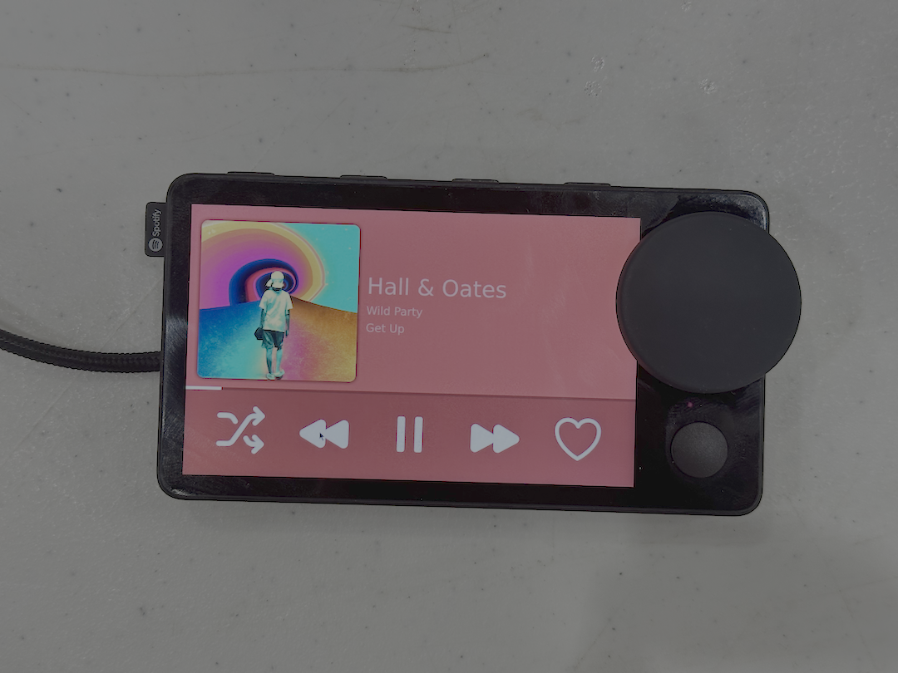

# Car Thang

Hawk Tuah, revive that Car Thing.

Car Thang is the first fully tether-free mod for the Spotify Car Thing. It does not require a computer to operate, and can be used just off your phone's Bluetooth just like the original. It can also join your phone's hotspot for internet-connected functionality.

This project was started for HackNC 2024. This project is under heavy renovation to add support for tether-free Bluetooth media. [View the HackNC Submission](https://devpost.com/software/car-thang).

If you would like to support the development of Car Thang, please consider sending us any old Car Things you may have lying around.

## Gallery (alpha version)




## Features

- [ ] Control Bluetooth media without internet
- [ ] Spotify integration with internet
- [ ] Support for other applications

More features coming soon!

## Installation

This project's installer is based on [nixos-superbird](https://github.com/JoeyEamigh/nixos-superbird). When the project is complete, it will feature a one-click install for anyone else who wants their Car Thing to be a Car Thing again!

## Building

This is a Rust app, so...

```sh
cargo run
```

## Bluetooth

This app will soon support both Bluetooth media and Bluetooth PAN to emulate the exact functionality of the original Car Thing.

Just leaving this here for safekeeping for now:

`dbus-send --system --type=method_call --dest=org.bluez /org/bluez/hci0/dev_<MAC_ADDRESS> org.bluez.Network1.Connect string:'nap'`
